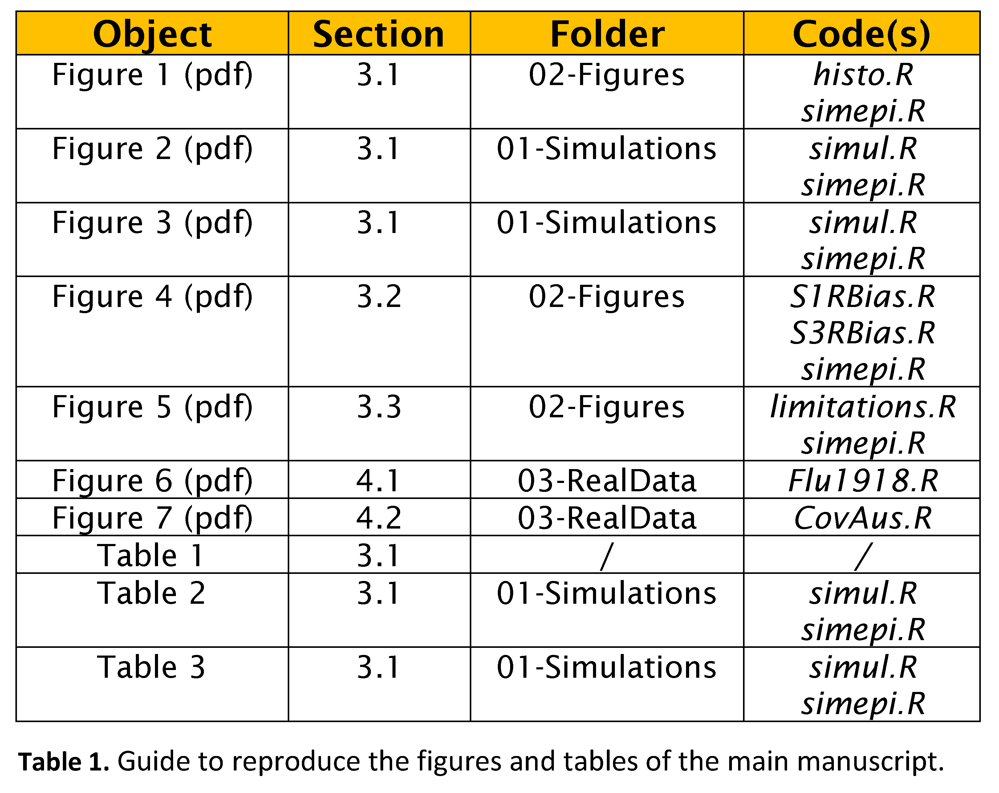

Reproducing the results of ‘An approximate Bayesian approach for
estimation of the instantaneous reproduction number under misrepoted
epidemic data’
================
Oswaldo Gressani
2022-09-03

### Structure of the repository

### Acknowledgments

This project is funded by the European Union’s Research and Innovation
Action under the H2020 work programme, EpiPose (grant number 101003688).
